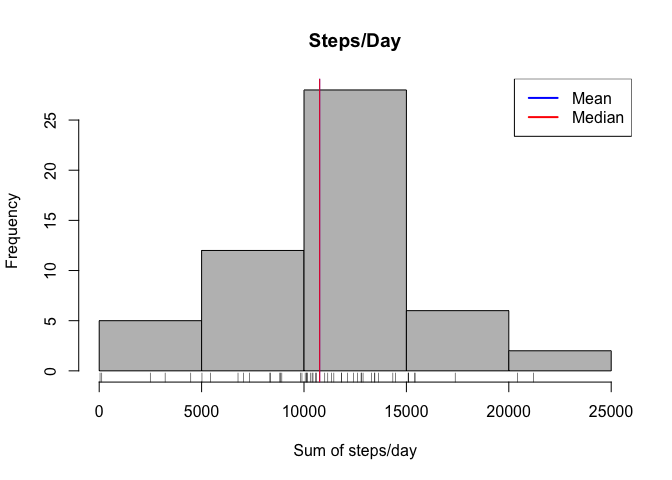
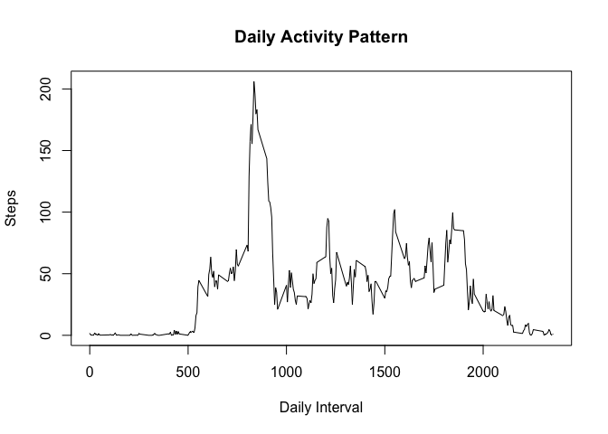
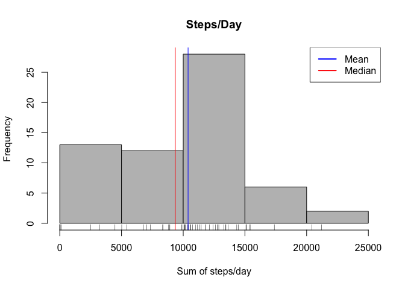
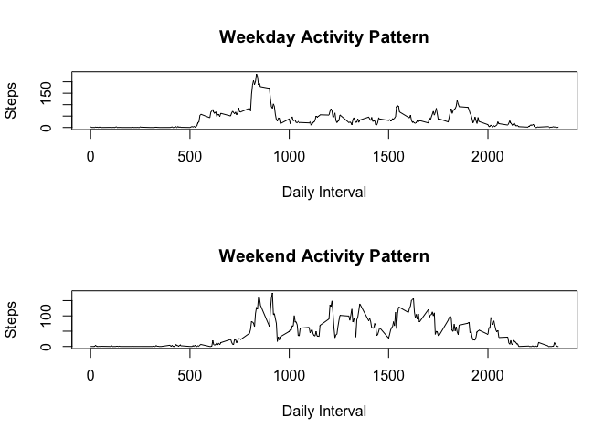

# PA1_template.Rmd
KMG  
November 14, 2015  

First make sure dataset is downloaded and in your current working directory. Next we will unpack the data and read into as project1. 


```r
library(dplyr)
```

```
## 
## Attaching package: 'dplyr'
## 
## The following objects are masked from 'package:stats':
## 
##     filter, lag
## 
## The following objects are masked from 'package:base':
## 
##     intersect, setdiff, setequal, union
```

```r
unzip("repdata-data-activity.zip")
project1 <- read.csv("activity.csv")
```

For this part of the assignment we will ignore missing values--later on we will then compare the output of the means and medians with and without the missing values. First, lets construct a secondary table with the total number of steps summed per day. Then we can plot a histogram of the steps/day. Without removing the NA values, plotting the mean and the median as an abline is not possible. So, the mean and the median are plotted with na.rm = TRUE. Because the mean and the median values are pretty close together, the red line(mean = 10766.19) and the blue line(median= 10765) merge to look purple on the histogram.


```r
by_date <- group_by(project1, date)
to_plot <- summarize(by_date, sum_steps = sum(steps))
summary(to_plot)
```

```
##          date      sum_steps    
##  2012-10-01: 1   Min.   :   41  
##  2012-10-02: 1   1st Qu.: 8841  
##  2012-10-03: 1   Median :10765  
##  2012-10-04: 1   Mean   :10766  
##  2012-10-05: 1   3rd Qu.:13294  
##  2012-10-06: 1   Max.   :21194  
##  (Other)   :55   NA's   :8
```

```r
hist(to_plot$sum_steps, col = "gray", xlab = "Sum of steps/day", main = "Steps/Day")
rug(to_plot$sum_steps)
abline(v = median(to_plot$sum_steps, na.rm = TRUE), col = "blue", lwd = 1)
abline(v = mean(to_plot$sum_steps, na.rm = TRUE), col = "red", lwd = 1)
legend(x = "topright", c("Mean", "Median"), col = c("blue", "red"), lwd = c(2, 2))
```

 

For the second part of the assignment we will make a new subtable for the daily activity pattern. Since the directions for this section do not mention missing values, let's assume we can correct for the missing values up front with na.rm = TRUE. Then take a summary to find the max value, followed by filtering for the top interval (835). I beleive this means 8:35 in the morning, with 206.17 steps.


```r
by_interval <- group_by(project1, interval)
to_plot1 <- summarize(by_interval, ave_steps = mean(steps, na.rm = TRUE))
summary(to_plot1)
```

```
##     interval        ave_steps      
##  Min.   :   0.0   Min.   :  0.000  
##  1st Qu.: 588.8   1st Qu.:  2.486  
##  Median :1177.5   Median : 34.113  
##  Mean   :1177.5   Mean   : 37.383  
##  3rd Qu.:1766.2   3rd Qu.: 52.835  
##  Max.   :2355.0   Max.   :206.170
```

```r
top_interval <- filter(to_plot1, ave_steps >206)
top_interval
```

```
## Source: local data frame [1 x 2]
## 
##   interval ave_steps
##      (int)     (dbl)
## 1      835  206.1698
```

```r
plot(to_plot1$interval, to_plot1$ave_steps, type = "l", 
    ylab = "Steps", xlab = "Daily Interval", main = "Daily Activity Pattern")
```

 

Now for the 3rd part of the assignment. Let's go back to total steps by day and remove the missing values. First get the total missing values by using the summary function (total number of NA's = 2304). Then, let's clean up by removing missing values at the sum stage. We will see how the summary changed, this time the mean (9354) and median (10395) are more spread apart, as can be seen in the new histogram chart.


```r
to_plot2 <- summarize(by_date, sum_steps = sum(steps, na.rm = TRUE))
summary(to_plot2)
```

```
##          date      sum_steps    
##  2012-10-01: 1   Min.   :    0  
##  2012-10-02: 1   1st Qu.: 6778  
##  2012-10-03: 1   Median :10395  
##  2012-10-04: 1   Mean   : 9354  
##  2012-10-05: 1   3rd Qu.:12811  
##  2012-10-06: 1   Max.   :21194  
##  (Other)   :55
```

```r
hist(to_plot2$sum_steps, col = "grey", xlab = "Sum of steps/day", main = "Steps/Day")
rug(to_plot2$sum_steps)
abline(v = median(to_plot2$sum_steps, na.rm = TRUE), col = "blue", lwd = 1)
abline(v = mean(to_plot2$sum_steps, na.rm = TRUE), col = "red", lwd = 1)
legend(x = "topright", c("Mean", "Median"), col = c("blue", "red"), lwd = c(2, 2))
```

 

For the final part of the assignment, first add a new column, day, using weekdays function. Then, split data into weekdays and weekends using grep. Finally graph by daily interval. Note that the mean of steps taken is highest during the weekends? Not sure that is right.


```r
project1$day <- weekdays(as.Date(project1$date))
weekdaycount <- project1[grep("Monday|Tuesday|Wednesday|Thursday|Friday", project1$day),]
weekendcount <- project1[grep("Saturday|Sunday", project1$day),]
by_interval_day <- group_by(weekdaycount, interval)
to_plot_day <- summarize(by_interval_day, ave_steps = mean(steps, na.rm = TRUE))
summary(to_plot_day)
```

```
##     interval        ave_steps      
##  Min.   :   0.0   Min.   :  0.000  
##  1st Qu.: 588.8   1st Qu.:  2.218  
##  Median :1177.5   Median : 23.974  
##  Mean   :1177.5   Mean   : 35.338  
##  3rd Qu.:1766.2   3rd Qu.: 51.872  
##  Max.   :2355.0   Max.   :234.103
```

```r
by_interval_end <- group_by(weekendcount, interval)
to_plot_end <- summarize(by_interval_end, ave_steps = mean(steps, na.rm = TRUE))
summary(to_plot_end)
```

```
##     interval        ave_steps      
##  Min.   :   0.0   Min.   :  0.000  
##  1st Qu.: 588.8   1st Qu.:  1.107  
##  Median :1177.5   Median : 32.036  
##  Mean   :1177.5   Mean   : 43.078  
##  3rd Qu.:1766.2   3rd Qu.: 75.571  
##  Max.   :2355.0   Max.   :175.000
```

```r
par(mfcol=c(2,1))
plot(to_plot_day$interval, to_plot_day$ave_steps, type = "l", 
     ylab = "Steps", xlab = "Daily Interval", main = "Weekday Activity Pattern")
plot(to_plot_end$interval, to_plot_end$ave_steps, type = "l",       
     ylab = "Steps", xlab = "Daily Interval", main = "Weekend Activity Pattern")
```

 

